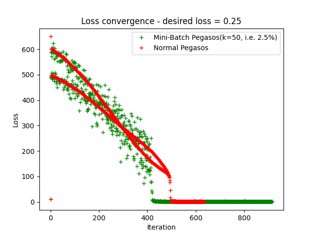
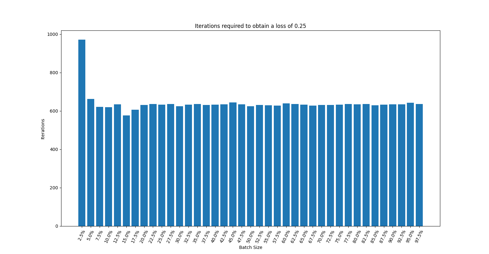
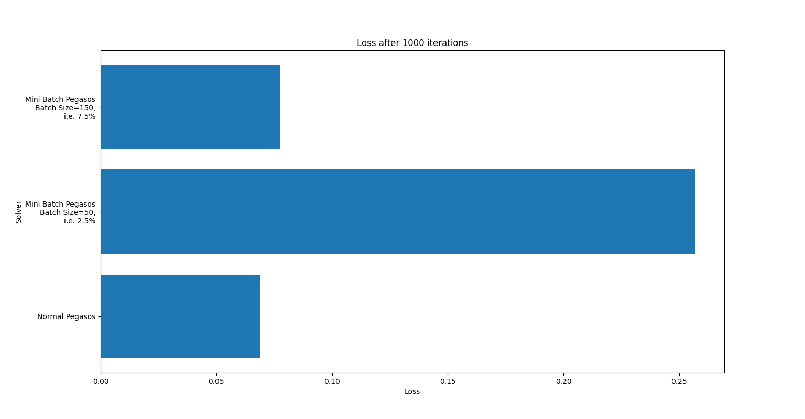

# Pegasos: Primal Estimated sub-GrAdient SOlver for SVM

Implementation for Pegasos, an algorithm for solving the optimization problem for Support Vector Machines.  
The algorithm has been proposed by Shai Shalev-Shwartz, Yoram Singer and Nathan Srebro in this [paper](paper/Paper_Pegasos.pdf).
  
  
  
  
